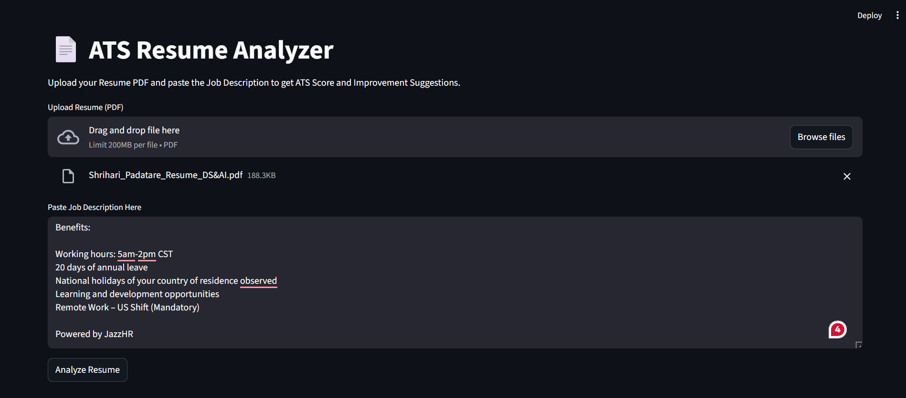
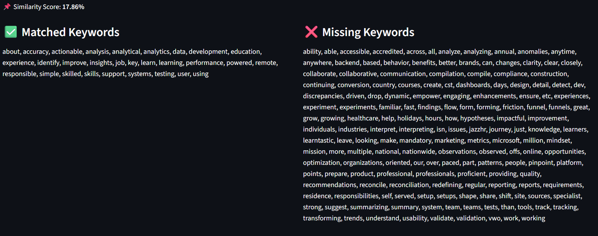
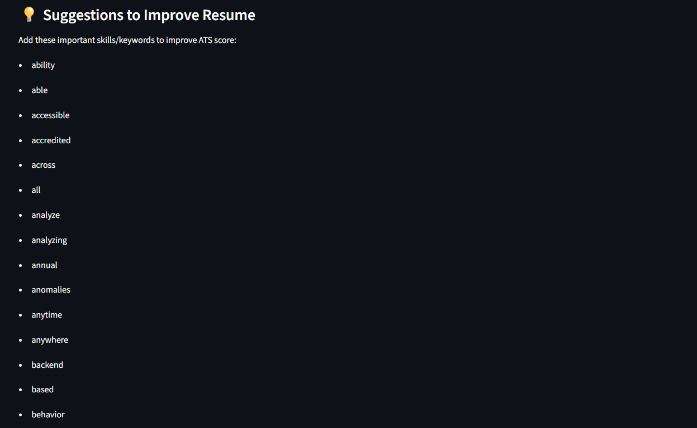

# 📄 ATS Resume Analyzer

An **AI-powered ATS Resume Analyzer** built using **Python, NLP, and Machine Learning**.  
This project compares a Resume with a Job Description and provides an **ATS Score**, matched keywords, missing keywords, and improvement suggestions.

This helps job seekers optimize their resumes for better shortlisting chances.

---

## 🚀 Features
- ✅ Upload Resume in PDF format  
- ✅ Paste Job Description  
- ✅ Calculates ATS Score (0–100)  
- ✅ TF-IDF + Cosine Similarity Matching  
- ✅ Extracts Resume Keywords & JD Keywords  
- ✅ Shows Matched and Missing Keywords  
- ✅ Suggests missing skills/keywords  
- ✅ Streamlit-based UI (easy to use)

---

## 🛠 Tech Stack
- Python  
- Streamlit  
- PyMuPDF (PDF text extraction)  
- Scikit-learn  
- TF-IDF Vectorizer  
- Cosine Similarity  

---

## 📂 Project Structure
```
ATS-Resume-Analyzer/
│── app.py
│── resume_parser.py
│── ats_scoring.py
│── keyword_matcher.py
│── requirements.txt
│── README.md
│── screenshots/
```

---

## ⚙️ How It Works
1. User uploads Resume PDF and pastes Job Description
2. Resume text is extracted using PyMuPDF
3. Resume text and Job Description are converted into TF-IDF vectors
4. Cosine similarity is calculated to measure resume-job match
5. Similarity score is converted into ATS Score (0–100)
6. Keywords are extracted from both Resume and Job Description
7. Matched and missing keywords are displayed
8. Suggestions are generated based on missing keywords

---

## ▶️ How to Run Locally

### 1. Clone Repository
```bash
git clone https://github.com/iamshrihari/ATS-Resume-Analyzer.git
cd ATS-Resume-Analyzer
```

### 2. Create Virtual Environment (Optional but Recommended)
```bash
python -m venv venv
```

### 3. Activate Virtual Environment

**Windows (PowerShell)**
```bash
venv\Scripts\activate
```

**Windows (CMD)**
```bash
venv\Scripts\activate.bat
```

**Mac/Linux**
```bash
source venv/bin/activate
```

### 4. Install Dependencies
```bash
pip install -r requirements.txt
```

### 5. Run Streamlit App
```bash
streamlit run app.py
```

---

## 📊 Output
- ✅ ATS Score (0–100)
- ✅ Similarity Match Percentage
- ✅ Matched Keywords
- ✅ Missing Keywords
- ✅ Improvement Suggestions

---

## 📸 Screenshots




---

## 🎯 Future Improvements
- Skill extraction using predefined skill database
- PDF report generation
- Resume section detection (Education, Skills, Experience)
- Deployment on Streamlit Cloud

BERT-based semantic matching for better scoring

👨‍💻 Author
Shrihari Padatare
GitHub: https://github.com/iamshrihari